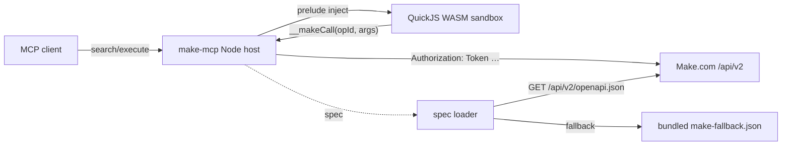

# Make.com Code-Mode MCP

[](LICENSE)
[](#project-status)
[](CHANGELOG.md)

> ## Project status
>
> **Public beta. Install from source. Not on npm yet.**
>
> One sandbox surface (`make.*`) covers the entire Make.com Web API v2
> (~467 operations on the EU1 zone). 85/85 unit + integration tests
> green, end-to-end LLM-mediated invocation verified through MCP
> Inspector CLI and opencode (DeepSeek v4 Flash) against a real Make.com
> Core-tier account (all-scope token, 12 sandbox host calls per
> discovery sweep). Read-only sweeps of `/users/me`,
> `/users/me/current-authorization`, `/organizations`, `/teams`,
> `/scenarios`, `/connections`, `/data-stores`, `/hooks`, and `/sdk/apps`
> are live-verified. Mutations are wired but **not** verified by us
> (write ops would consume Make.com operation credits and need a
> non-production tenant). See [verification status](#verification-status)
> for what is actually proven.

A Model Context Protocol (MCP) server for the **Make.com Web API v2**, built on the **Cloudflare "Code Mode" pattern**: instead of one MCP tool per endpoint, the server exposes **two tools** — `search` and `execute` — and the LLM writes JavaScript that runs in a QuickJS WASM sandbox. This keeps the LLM context small (~constant) regardless of how big the underlying API is.

## Why Code Mode?

The Make.com Web API v2 has **~467 endpoints** across **83 tags** (scenarios, connections, data stores, hooks, organizations, teams, users, agents, SDK apps, admin/HQ, …). Exposing each as a separate MCP tool floods the LLM context with tens of thousands of tokens before the model has read the user's question. Code Mode collapses the entire API surface into two tools and lets the model search the OpenAPI spec, then execute calls programmatically — including loops, batching, and post-processing. See Cloudflare's [Code Mode for MCP](https://blog.cloudflare.com/code-mode-mcp/) blog post and the official `@cloudflare/codemode` package.

## Highlights

- **Cloudflare Code Mode compatible** — two-tool design (`search` + `execute`), QuickJS WASM sandbox semantics.
- **One flat surface — `make.*`** — every Make.com Web API v2 operation, including admin/internal endpoints, exposed through the same sandbox namespace. No surface splits, no hidden filtering — 403s are self-documenting (and decorated with the scope hint from `operation.security`).
- **Single-user (env) and multi-user (per-request HTTP headers)** — same server runs as a private workspace tool or a hosted multi-tenant gateway.
- **Zone-aware** — `MAKE_BASE_URL` / `X-Make-Base-Url` selects the regional zone (defaults to `https://eu1.make.com/api/v2`). Unknown base URLs warn at startup but still work.
- **Dynamic OpenAPI loading** — the spec is fetched live from `${MAKE_BASE_URL}/openapi.json` at boot, hash-cached on disk, and falls back to a bundled snapshot when the live fetch fails.
- **Scope-aware 401/403 errors** — `[make.http] HTTP 403 on /scenarios: ... (operation requires scope ``scenarios:read``)` so the model can tell the user exactly which scope their token is missing.
- **Hybrid deployment** — runs on Node.js (stdio + Streamable HTTP); a Cloudflare Workers scaffold ships in `cf-worker/` for parity-smoke verification.
- **Plan-tier aware** — verified end-to-end against a Make.com **Core** account (all-scope token). Free-tier tokens still work for read-only `/users/me` / `/organizations` / `/teams` probes; tier-gated endpoints (e.g. audit logs need Pro/Teams) return upstream `402 Payment Required` and admin endpoints are VPN-gated `403`s — both surface verbatim with the operation path and Make.com error code.

## For agents driving this server

If you're an LLM agent (or a human configuring one) connecting to a running instance, read [`SKILL.md`](SKILL.md) for the operating manual — the `search → execute` loop, the single `make.*` surface, the three call shapes, the error taxonomy, and ready-to-paste recipes. The example persona at [`examples/make-expert-agent/`](examples/make-expert-agent/) bundles a focused "Make.com automation expert" system prompt plus cross-platform install snippets.

## Quickstart (single-user / stdio)

```bash
git clone https://github.com/jmpijll/make-code-mode-mcp.git
cd make-code-mode-mcp
npm install
cp .env.example .env
# Edit .env: MAKE_API_KEY=...  (defaults: MAKE_BASE_URL=https://eu1.make.com/api/v2)
npm run build
npm start                # MCP_TRANSPORT=stdio
```

Then point your MCP client at `node /path/to/make-code-mode-mcp/dist/index.js`.

## Quickstart (multi-user / HTTP)

```bash
MCP_TRANSPORT=http npm start
```

Each MCP client request must include credentials as headers:

```http
POST /mcp HTTP/1.1
X-Make-Api-Key: <your make.com api token>
X-Make-Base-Url: https://eu1.make.com/api/v2
```

See [`docs/multi-tenant.md`](docs/multi-tenant.md).

## Example session

The model first searches the spec:

```js
// search tool
findOperationsByPath('/scenarios')
  .filter((op) => op.method === 'GET')
  .map((op) => ({ id: op.operationId, path: op.path, summary: op.summary }));
```

Then executes calls:

```js
// execute tool — list scenarios in the first team of the first org
// (Make.com's pg[…] pagination is encoded automatically from nested objects)
(async () => {
  const orgs = await make.callOperation('getOrganizations', {});
  const teams = await make.callOperation('getTeams', { organizationId: orgs.organizations[0].id });
  const scenarios = await make.callOperation('listScenarios', {
    teamId: teams.teams[0].id,
    pg: { limit: 25, sortBy: 'name', sortDir: 'asc' },
  });
  return scenarios.scenarios.map((s) => ({ id: s.id, name: s.name, isActive: s.isActive }));
})();
```

## Architecture



## Status

Pre-1.0. The Make.com Web API v2 spec is loaded dynamically from `${MAKE_BASE_URL}/openapi.json`; the server adapts to spec mutations without code edits.

### Verification status

What we have **directly verified** so far:

| Layer | How | Result |
|---|---|---|
| Unit tests | Vitest, 85 cases across config, tenant, spec loader, spec index, HTTP client (including `pg[limit]` bracket-notation query encoding), dispatcher, sandbox, integration scenarios | ✅ all green |
| Integration tests (in-process MCP transport) | `InMemoryTransport` against `createMcpServer` + a mock Make.com Web API v2 | ✅ green |
| Integration tests (real Streamable HTTP transport) | `StreamableHTTPClientTransport` over a real HTTP listener | ✅ green |
| Live HTTP-client round-trip | In-process mock asserting `Authorization: Token …`, 429 retry, and scope-aware 403 error formatting | ✅ green |
| **Live read-only sweep on a real Make.com tenant** | `npm run live-test` against `https://eu1.make.com/api/v2` with a 1Password-managed **Core-tier** API key (all 67 scopes including `admin:read`, `scenarios:run`, `mcp:use`); 3-call sandbox sweep through `/users/me`, `/organizations`, `/teams` | ✅ 3/3 calls returned real data in ~220 ms; transcript at `out/verification/make-live-smoke.txt` (PII redacted) |
| **Broad read-only discovery sweep** | `npm run discover` — 12-call sandbox traversal through `/users/me`, `/users/me/current-authorization`, `/admin/owners`, `/sdk/apps`, `/organizations`, `/teams`, `/audit-logs/organization/{id}`, plus per-team `/scenarios`, `/connections`, `/data-stores`, `/hooks`, `/audit-logs/team/{id}` — uses Make.com's bracketed `pg[limit]=…` pagination syntax end-to-end | ✅ 12 calls; sdk/apps + connections + scenarios + data-stores + hooks succeed; audit-logs return `402 Payment Required` (need Teams/Enterprise plan); `/admin/owners` returns `403 VPN access only [IM121]` (IP-gated, not scope-gated); transcript at `out/verification/make-discover-core.txt` |
| **MCP Inspector (CLI mode)** | `@modelcontextprotocol/inspector@0.20.0 --cli --transport stdio` against the live API; `tools/list`, credentialled `search` (`findOperationsByPath`), credentialled `execute` (`getUsersMe`), a credentialled 403 probe (`/admin/owners`), and a credentialled `pg[limit]` bracket-encoding probe | ✅ all five phases pass; transcripts in `out/verification/mcp-inspector-*.txt` |
| **End-to-end LLM-mediated invocation via opencode** | DeepSeek v4 Flash via `opencode-go` provider, project-scoped `opencode.json`, opencode v1.14.30 — model called `make_search` with `spec.operations.length` then `make_execute` with the async-IIFE `getUsersMe` recipe | ✅ Model received MCP tools as `make_search` / `make_execute`, called them with the right code, server returned `467` (operation count) and the real user `{name, email}`; transcripts at `out/verification/opencode-make-mcp-*.txt` |
| **Cloudflare Workers — `wrangler dev` parity smoke** | `npm run cf:dev` (Miniflare) + curl probes against `/health`, `/mcp`, unknown paths | ✅ Worker boots; `/health` → `{"status":"ok"}`; `/mcp` without creds → 401 with documented missing-header message; `/mcp` with creds → 502 (spec-load failure for stub baseUrl, as expected); unknown path → 404. The 501 transport-adapter scaffold is documented and unreachable without real creds + a publicly-trusted controller. Transcript at `out/verification/cf-worker-parity-smoke.txt` |

What is **not yet verified** (testers welcome):

- Mutating operations (POST/PUT/PATCH/DELETE) — wired but unproven. Make.com bills "operations" for *scenario module executions*, not API calls, so listing/inspecting is free, but creating real scenarios still has side effects that we don't want to ship into a production tenant. Verification is gated on having a throwaway non-production tenant.
- Admin/internal endpoints (`/admin/*`, `/hq/*`, `/debug/*`, `/mailhub/*`) — the token has `admin:read`/`admin:write` scopes, but `/admin/owners` cleanly returns `403 VPN access only [IM121]` from outside Make's office network. Behaviour from a VPN-allowlisted environment is unverified.
- Audit logs (`/audit-logs/*`) — the token has the scope, but the endpoint requires Make's **Teams / Enterprise** tier and returns `402 Payment Required` on a Core plan.
- Other regional zones (`eu2`, `us1`, `us2`, Celonis variants) — the loader trusts whatever `MAKE_BASE_URL` resolves to; only EU1 has been driven end-to-end.
- Other agent / IDE clients beyond MCP Inspector CLI and opencode (Cursor, Claude Desktop, Claude Code, Continue, Cline, Codeium, Aider, Zed, …) and the MCP Inspector UI / HTTP / SSE transports.
- Hosted/multi-tenant deployment behind a reverse proxy.
- Long-running soak / stability under sustained load.
- The Cloudflare Workers transport adapter — the routing, auth-header validation, spec loader, and 404/401/502 paths all work; the 501 transport-adapter scaffold and `worker_loaders` `LOADER` binding (requires `wrangler@4`) remain unimplemented.

## Plan tiers & scopes

Make.com's [pricing page](https://www.make.com/en/pricing) gates *some* API surfaces by paid tier:

- **Free plan** has "Limited" API access. Read-only `/users/me`, `/organizations`, and team-scoped listing typically work; admin/HQ paths and many write ops will 403.
- **Core plan** (verified) unlocks the bulk of the API. Audit logs still require Teams/Enterprise (`402 Payment Required`). Admin endpoints are additionally IP-gated to Make's VPN (`403 VPN access only [IM121]`) regardless of plan.

The server's error messages quote Make.com's response verbatim — including the `[IM121]`, `[SC400]`, `[SC403]` error codes — so the model can tell the user whether the block is plan-tier, scope, or network, and stop guessing.

## Documentation

- [`docs/architecture.md`](docs/architecture.md) — How the server is built, request lifecycle, sandbox details.
- [`docs/multi-tenant.md`](docs/multi-tenant.md) — Header protocol, deployment patterns, security model.
- [`docs/security.md`](docs/security.md) — Threat model, credential handling, sandbox guarantees.
- [`docs/deployment.md`](docs/deployment.md) — Docker, Cloudflare Workers, systemd.
- [`docs/usage.md`](docs/usage.md) — Tool descriptions, common patterns, gotchas.

## License

MIT — see [`LICENSE`](LICENSE).
