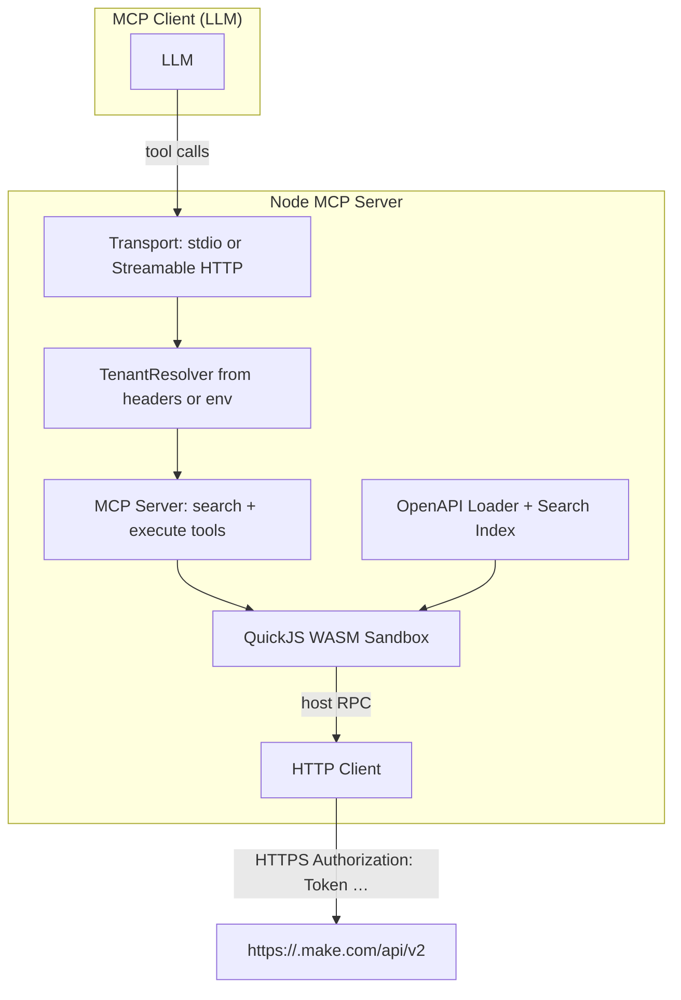

# Architecture



## Request lifecycle (HTTP transport)

1. Client sends an MCP `tools/call` request to `POST /mcp`.
2. The Node HTTP handler reads `X-Make-*` headers, runs the request inside an `AsyncLocalStorage` scope, and forwards to the MCP SDK's `StreamableHTTPServerTransport`.
3. The MCP server's `execute` tool handler invokes a per-request `tenantResolver()`. It reads the ALS scope to build a fresh `TenantContext`.
4. A new `ExecuteExecutor` is constructed bound to that context, instantiating a per-tenant `HttpClient` lazily.
5. The QuickJS WASM sandbox is created. A prelude builds the `make.*` proxy methods from the OpenAPI operation index. The user's code runs inside.
6. When sandbox code calls `make.scenarios.listScenarios({...})`, the prelude calls a host-bound function (`__makeCall`) which dispatches through the HTTP client. Credentials are read from the `TenantContext` *here*, never from the sandbox.
7. Result is JSON-serialized into the sandbox; user code returns a final value or throws. The executor awaits the resulting Promise.
8. Host captures the result, formats it as MCP tool content, sends to the client, and disposes the sandbox.

## Sandbox

QuickJS WASM via [`quickjs-emscripten`](https://github.com/justjake/quickjs-emscripten). Limits enforced per-execute (see `src/sandbox/limits.ts`):

- Time: 30 s deadline (interrupt handler).
- Memory: 64 MB (`runtime.setMemoryLimit`).
- Stack: 512 KB.
- API call budget: 25 calls (configurable via `MAKE_MAX_CALLS_PER_EXECUTE`).
- Code input: 100 000 chars.
- Result: 100 000 chars (truncated with notice).
- Console capture: 1 MB / 1000 entries.

Two executors:

- **SearchExecutor** — synchronous QuickJS context. Exposes `spec`, `searchOperations(...)`, `getOperation(...)`, `findOperationsByPath(...)`. No network access.
- **ExecuteExecutor** — async QuickJS context (`newAsyncContext()`). Exposes the `make` namespace built from the loaded spec. Host calls (`__makeCall`, `__makeRaw`) return Promises that user code awaits inside an async IIFE.

## Spec ingestion

1. On startup, the loader attempts `GET ${MAKE_BASE_URL}/openapi.json` (which by default resolves to `https://eu1.make.com/api/v2/openapi.json`).
2. Resolves `$ref`s using `@apidevtools/json-schema-ref-parser`.
3. Builds a flat operation index: `operationId`, `method`, `path`, primary tag, parameters, request-body flag, **`requiredScopes`** extracted from `operation.security`.
4. Hashes the dereferenced doc with SHA256 and stores the processed index at `src/spec/cache/<hash>.json`. The `CACHE_SCHEMA_VERSION` constant (in `src/spec/loader.ts`) gates cache reuse — bump it whenever you change `processSpec` or `buildOperationIndex`.
5. If the live fetch fails (network outage, zone unreachable, transient 5xx), the loader falls back to the bundled `src/spec/make-fallback.json`.

The bundled fallback is refreshed manually with `npm run update-spec` (which fetches from the currently-configured `MAKE_BASE_URL`).

## Authentication

Make.com authenticates with `Authorization: Token <api-key>`. The single `HttpClient` factory (`src/client/factory.ts`) accepts a `TenantContext` and produces an HTTP client with that header pre-applied. The path prefix is the empty string — `/api/v2` is part of `MAKE_BASE_URL`.

## Rate-limit handling

When Make.com returns `429 Too Many Requests`, the HTTP client respects the `Retry-After` header (capped at 60 s) and retries once. Subsequent 429s propagate as `MakeHttpError` to the sandbox.

## Scope-aware errors

When a typed `make.callOperation(...)` returns 401 or 403, the HTTP client looks up the operation's `requiredScopes` (extracted at spec-processing time) and decorates the error message:

```text
[make.http] HTTP 403 on /scenarios: ... (operation requires scope `scenarios:read` — check your Make.com API token has it)
```

This is one of the few "smart" behaviours in the dispatcher — the model needs the scope name to tell the user how to fix the failure. Raw `make.request(...)` calls don't have an operation context so their 403s are unannotated.

## Cloudflare Workers entry

A thin alternative deployment (`cf-worker/`) using `@cloudflare/codemode`'s `openApiMcpServer` + `DynamicWorkerExecutor` (Worker Loader-backed isolate). The Worker inherits the same per-request header contract. See [`cf-worker/README.md`](../cf-worker/README.md) for status and limitations — at the time of writing, the transport adapter is a 501 scaffold; routing, auth-header validation, spec loader, and the 401/502/404 paths are working.
