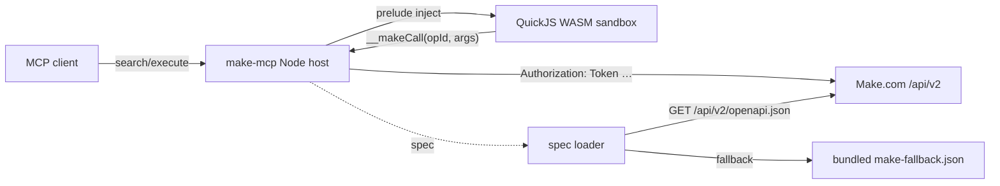

# Usage

## Install

```bash
git clone https://github.com/jmpijll/make-code-mode-mcp.git
cd make-code-mode-mcp
npm install      # uses --legacy-peer-deps via .npmrc
npm run build
```

## Configure

```bash
cp .env.example .env
$EDITOR .env
```

| Variable | Required | Default | Notes |
|---|---|---|---|
| `MAKE_API_KEY` | yes (single-user) | — | Make.com Web API v2 token. Mint one at `https://<zone>.make.com/profile/api`. |
| `MAKE_BASE_URL` | no | `https://eu1.make.com/api/v2` | Regional zone base URL. Known zones: `eu1`, `eu2`, `us1`, `us2`, plus two Celonis variants. Unknown URLs emit a startup warning but otherwise work. |
| `MCP_TRANSPORT` | no | `stdio` | Set to `http` for multi-user. |
| `MCP_HTTP_PORT` | no | `3000` | Listen port when `MCP_TRANSPORT=http`. |
| `MCP_HTTP_ALLOWED_ORIGINS` | no | (none) | Comma-separated CORS allow-list. |
| `MAKE_SPEC_URL` | no | `${MAKE_BASE_URL}/openapi.json` | Override the spec endpoint. |
| `MAKE_SPEC_CACHE_DIR` | no | `src/spec/cache` | Hash-keyed on-disk spec cache. |
| `MAKE_MAX_CALLS_PER_EXECUTE` | no | `25` | Per-`execute` call budget. |
| `MAKE_EXECUTE_TIMEOUT_MS` | no | `30000` | Per-`execute` wall-clock timeout. |

## Run

### Single-user (stdio)

```bash
npm start
```

Point your MCP client at `node /path/to/make-code-mode-mcp/dist/index.js`.

### Multi-user (HTTP)

```bash
MCP_TRANSPORT=http npm start
```

Then `POST /mcp` with credentials in headers:

```http
POST /mcp HTTP/1.1
Content-Type: application/json
X-Make-Api-Key: <your token>
X-Make-Base-Url: https://eu1.make.com/api/v2

{ "jsonrpc": "2.0", "method": "tools/list", "id": 1 }
```

See [`multi-tenant.md`](multi-tenant.md).

## The two tools

### `search`

Read-only sandbox over the OpenAPI spec. Globals: `spec`, `searchOperations(query, limit?)`, `getOperation(operationIdOrLocator)`, `findOperationsByPath(substring)`, `console.log(...)`. No network access. Final expression is the tool result.

### `execute`

Live sandbox with the `make` namespace bound:

```js
make.spec                                  // { title, version, sourceUrl, operationCount }
make.callOperation(operationId, args)      // typed call by operationId
make.request({ method, path, query, body, headers, pathParams })
make.<tag>.<operationId>(args)             // tag-grouped accessor sugar
```

Host calls are async — wrap your code in an async IIFE so the executor can unwrap the resulting Promise:

```js
(async () => {
  const me = await make.callOperation('getUsersMe', {});
  return { id: me.authUser.id, email: me.authUser.email };
})();
```

See [`SKILL.md`](../SKILL.md) for the full operating manual.

## Operational scripts

```bash
npm run update-spec        # refresh src/spec/make-fallback.json from MAKE_BASE_URL
npm run live-test          # read-only sweep: /users/me + /organizations + /teams
npm run discover           # broader sweep: orgs → teams → scenarios; writes JSON to out/
```

`live-test` and `discover` resolve `MAKE_API_KEY` from the environment first, then fall back to 1Password (`op read 'op://AI Agents/Make.com API Key Full Access/password'` by default; override via `OP_MAKE_REF`).

## Common gotchas

- **Three distinct upstream gates** can produce 4xx responses: plan tier (`402 Payment Required` for endpoints that need Teams/Enterprise), token scope (`403` with scope hint in the error), and IP allowlist (`403 VPN access only [IM121]` for `/admin/*` from outside Make's VPN). Read the status + code before claiming a scope problem. See SKILL §11.
- **One zone per server.** Register multiple MCP entries to talk to multiple zones from one client.
- **Top-level `await` and `return` are not allowed.** Use an async IIFE: `(async () => { … })()`.
- **Don't invent operationIds.** Always confirm with `search` first — the spec changes per zone and per release.


---

# Setup and verification reference

The following details were moved from the README during repository harmonization.
Historical verification records describe the maintainer's earlier runs; they are not
claims that live services or clients were retested in this change.

## Quickstart (single-user / stdio)

```bash
git clone https://github.com/jmpijll/make-code-mode-mcp.git
cd make-code-mode-mcp
npm ci
cp .env.example .env
# Edit .env: MAKE_API_KEY=...  (defaults: MAKE_BASE_URL=https://eu1.make.com/api/v2)
npm run build
npm start                # MCP_TRANSPORT=stdio
```

Then point your MCP client at `node /path/to/make-code-mode-mcp/dist/index.js`.

## Quickstart (multi-user / HTTP)

```bash
MCP_TRANSPORT=http npm start
```

Each MCP client request must include credentials as headers:

```http
POST /mcp HTTP/1.1
X-Make-Api-Key: <your make.com api token>
X-Make-Base-Url: https://eu1.make.com/api/v2
```

See [`docs/multi-tenant.md`](../docs/multi-tenant.md).

## Example session

The model first searches the spec:

```js
// search tool
findOperationsByPath('/scenarios')
  .filter((op) => op.method === 'GET')
  .map((op) => ({ id: op.operationId, path: op.path, summary: op.summary }));
```

Then executes calls:

```js
// execute tool — list scenarios in the first team of the first org
// (Make.com's pg[…] pagination is encoded automatically from nested objects)
(async () => {
  const orgs = await make.callOperation('getOrganizations', {});
  const teams = await make.callOperation('getTeams', { organizationId: orgs.organizations[0].id });
  const scenarios = await make.callOperation('listScenarios', {
    teamId: teams.teams[0].id,
    pg: { limit: 25, sortBy: 'name', sortDir: 'asc' },
  });
  return scenarios.scenarios.map((s) => ({ id: s.id, name: s.name, isActive: s.isActive }));
})();
```

## Status

Pre-1.0. The Make.com Web API v2 spec is loaded dynamically from `${MAKE_BASE_URL}/openapi.json`; the server adapts to spec mutations without code edits.

### Verification status

What we have **directly verified** so far:

| Layer | How | Result |
|---|---|---|
| Unit tests | Vitest, 85 cases across config, tenant, spec loader, spec index, HTTP client (including `pg[limit]` bracket-notation query encoding), dispatcher, sandbox, integration scenarios | ✅ all green |
| Integration tests (in-process MCP transport) | `InMemoryTransport` against `createMcpServer` + a mock Make.com Web API v2 | ✅ green |
| Integration tests (real Streamable HTTP transport) | `StreamableHTTPClientTransport` over a real HTTP listener | ✅ green |
| Live HTTP-client round-trip | In-process mock asserting `Authorization: Token …`, 429 retry, and scope-aware 403 error formatting | ✅ green |
| **Live read-only sweep on a real Make.com tenant** | `npm run live-test` against `https://eu1.make.com/api/v2` with a 1Password-managed **Core-tier** API key (all 67 scopes including `admin:read`, `scenarios:run`, `mcp:use`); 3-call sandbox sweep through `/users/me`, `/organizations`, `/teams` | ✅ 3/3 calls returned real data in ~220 ms; transcript at `out/verification/make-live-smoke.txt` (PII redacted) |
| **Broad read-only discovery sweep** | `npm run discover` — 12-call sandbox traversal through `/users/me`, `/users/me/current-authorization`, `/admin/owners`, `/sdk/apps`, `/organizations`, `/teams`, `/audit-logs/organization/{id}`, plus per-team `/scenarios`, `/connections`, `/data-stores`, `/hooks`, `/audit-logs/team/{id}` — uses Make.com's bracketed `pg[limit]=…` pagination syntax end-to-end | ✅ 12 calls; sdk/apps + connections + scenarios + data-stores + hooks succeed; audit-logs return `402 Payment Required` (need Teams/Enterprise plan); `/admin/owners` returns `403 VPN access only [IM121]` (IP-gated, not scope-gated); transcript at `out/verification/make-discover-core.txt` |
| **MCP Inspector (CLI mode)** | `@modelcontextprotocol/inspector@0.20.0 --cli --transport stdio` against the live API; `tools/list`, credentialled `search` (`findOperationsByPath`), credentialled `execute` (`getUsersMe`), a credentialled 403 probe (`/admin/owners`), and a credentialled `pg[limit]` bracket-encoding probe | ✅ all five phases pass; transcripts in `out/verification/mcp-inspector-*.txt` |
| **End-to-end LLM-mediated invocation via opencode** | DeepSeek v4 Flash via `opencode-go` provider, project-scoped `opencode.json`, opencode v1.14.30 — model called `make_search` with `spec.operations.length` then `make_execute` with the async-IIFE `getUsersMe` recipe | ✅ Model received MCP tools as `make_search` / `make_execute`, called them with the right code, server returned `467` (operation count) and the real user `{name, email}`; transcripts at `out/verification/opencode-make-mcp-*.txt` |
| **End-to-end LLM-mediated invocation via OpenAI Codex (CLI + desktop app)** | `codex-cli 0.131.0-alpha.9` (bundled with `Codex.app`), `gpt-5.5`. Server registered once via `codex mcp add make -- node …/dist/index.js`; entry lives in `~/.codex/config.toml` and is shared by both the CLI and the Codex macOS desktop app. CLI ran the two-step `mcp__make__search` / `mcp__make__execute` recipe via `codex exec --json`; the Codex desktop app drove the same recipe interactively after approving the `make` server. | ✅ Tools surface as `mcp__make__search` / `mcp__make__execute` in both clients; CLI returned `opCount=467 userId=<id>` from a single `search → execute → reply` round-trip; desktop app produced the same result interactively. CLI transcript at `out/verification/codex-cli-make-mcp.txt`. |
| **Cloudflare Workers — `wrangler dev` parity smoke** | `npm run cf:dev` (Miniflare) + curl probes against `/health`, `/mcp`, unknown paths | ✅ Worker boots; `/health` → `{"status":"ok"}`; `/mcp` without creds → 401 with documented missing-header message; `/mcp` with creds → 502 (spec-load failure for stub baseUrl, as expected); unknown path → 404. The 501 transport-adapter scaffold is documented and unreachable without real creds + a publicly-trusted controller. Transcript at `out/verification/cf-worker-parity-smoke.txt` |

What is **not yet verified** (testers welcome):

- Mutating operations (POST/PUT/PATCH/DELETE) — wired but unproven. Make.com bills "operations" for *scenario module executions*, not API calls, so listing/inspecting is free, but creating real scenarios still has side effects that we don't want to ship into a production tenant. Verification is gated on having a throwaway non-production tenant.
- Admin/internal endpoints (`/admin/*`, `/hq/*`, `/debug/*`, `/mailhub/*`) — the token has `admin:read`/`admin:write` scopes, but `/admin/owners` cleanly returns `403 VPN access only [IM121]` from outside Make's office network. Behaviour from a VPN-allowlisted environment is unverified.
- Audit logs (`/audit-logs/*`) — the token has the scope, but the endpoint requires Make's **Teams / Enterprise** tier and returns `402 Payment Required` on a Core plan.
- Other regional zones (`eu2`, `us1`, `us2`, Celonis variants) — the loader trusts whatever `MAKE_BASE_URL` resolves to; only EU1 has been driven end-to-end.
- Other agent / IDE clients beyond MCP Inspector CLI, opencode, Codex CLI, and the Codex desktop app (Cursor, Claude Desktop, Claude Code, Continue, Cline, Codeium, Aider, Zed, …) and the MCP Inspector UI / HTTP / SSE transports.
- Hosted/multi-tenant deployment behind a reverse proxy.
- Long-running soak / stability under sustained load.
- The Cloudflare Workers transport adapter — the routing, auth-header validation, spec loader, and 404/401/502 paths all work; the `worker_loaders` `LOADER` binding is wired in (wrangler@4 ships in `devDependencies` and recognises the binding on `deploy --dry-run`), but the 501 transport-adapter scaffold bridging the MCP SDK's `node:http` transport to the Workers Fetch API is still TODO.

## Plan tiers & scopes

Make.com's [pricing page](https://www.make.com/en/pricing) gates *some* API surfaces by paid tier:

- **Free plan** has "Limited" API access. Read-only `/users/me`, `/organizations`, and team-scoped listing typically work; admin/HQ paths and many write ops will 403.
- **Core plan** (verified) unlocks the bulk of the API. Audit logs still require Teams/Enterprise (`402 Payment Required`). Admin endpoints are additionally IP-gated to Make's VPN (`403 VPN access only [IM121]`) regardless of plan.

The server's error messages quote Make.com's response verbatim — including the `[IM121]`, `[SC400]`, `[SC403]` error codes — so the model can tell the user whether the block is plan-tier, scope, or network, and stop guessing.

## Architecture


